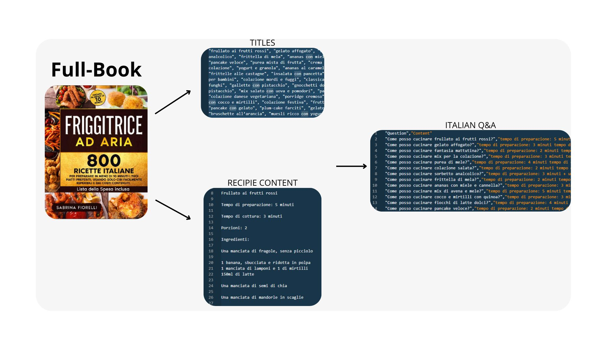
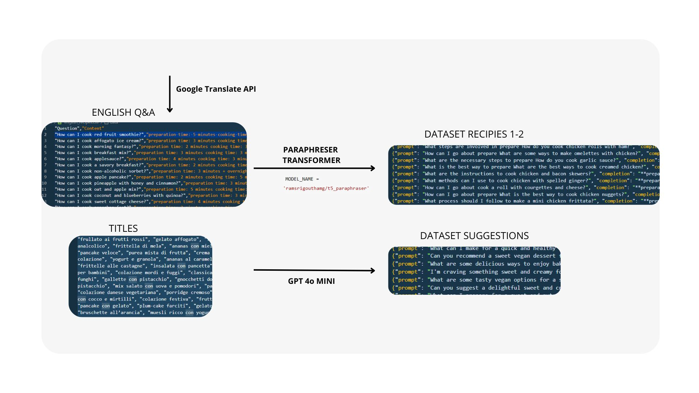

# LAB2_Scalable

This repository contains the implementation for Lab 2 of the "Scalable Machine Learning and Deep Learning" course. The project aims to develop a fine-tuned machine learning model specifically designed for Italian recipes prepared using an air fryer.

## Project Overview

The dataset for this project is derived from a well-known Italian cookbook featuring 800 recipes tailored for air fryers. The project involves extracting and processing recipe data, creating structured question-and-answer datasets, and generating additional paraphrased and translated content for fine-tuning the model.

## Workflow

The process for retrieving and preparing the data is illustrated below:

1. **Data Extraction from the Cookbook**  
   Recipes and titles were extracted from the book to create a structured dataset. Each recipe includes details like preparation time, cooking time, portions, and ingredients.

   

2. **Dataset Creation and Transformation**  
   Using a combination of translation APIs, paraphrasing transformers, and fine-tuned GPT models, the extracted data was transformed into multiple datasets. These datasets include Q&A pairs in both Italian and English, paraphrased questions, and recipe suggestions.

   

The final dataset can be found at:  
**[DATA/recipes_suggestion.jsonl](./DATA/recipes_suggestion.jsonl)**
