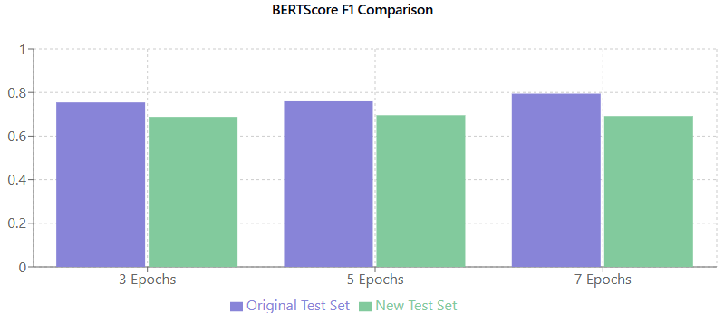
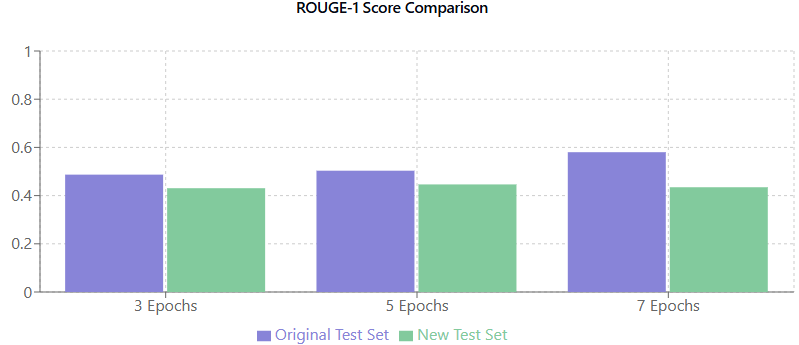
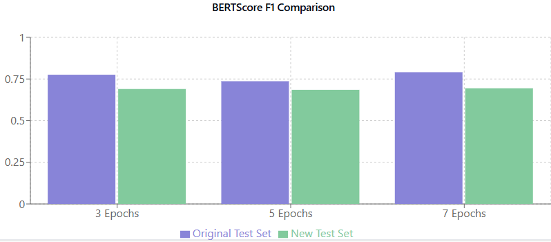
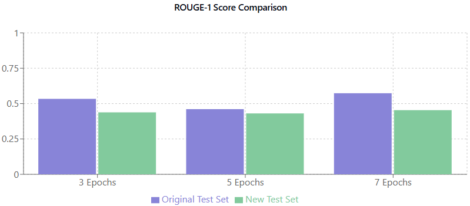

# LAB2_Scalable

This repository contains the implementation for Lab 2 of the "Scalable Machine Learning and Deep Learning" course. The project aims to develop a fine-tuned machine learning model specifically designed for Italian recipes prepared using an air fryer.

## Project Overview

The dataset for this project is derived from a well-known Italian cookbook featuring 800 recipes tailored for air fryers. The project involves extracting and processing recipe data, creating structured question-and-answer datasets, and generating additional paraphrased and translated content for fine-tuning the model.

## Workflow

The process for retrieving and preparing the data is illustrated below:

1. **Data Extraction from the Cookbook**  
   Recipes and titles were extracted from the book to create a structured dataset. Each recipe includes details like preparation time, cooking time, portions, and ingredients.

   

2. **Dataset Creation and Transformation**  
   Using a combination of translation APIs, paraphrasing transformers, and fine-tuned GPT models, the extracted data was transformed into multiple datasets. These datasets include Q&A pairs in both Italian and English, paraphrased questions, and recipe suggestions.

   
   The final dataset can be found at:  
   **[DATA/recipes_suggestion.jsonl](./DATA/recipes_suggestion.jsonl)**

4. **Training different models**
   Multiple model   


## Inference and Testing

As outlined in the previous section, the testing phase involved evaluating the model's performance by providing answers to various prompts and analyzing its responses. To ensure a comprehensive evaluation, we tested the model on both learned recipes and new, unseen recipes.

To achieve this, we created a dataset named **[DATA/recipes_suggestion.jsonl](./DATA/recipes_suggestion.jsonl)**, which contains 40 reformulated questions based on recipes used during training. These questions were rephrased using GPT-01-mini to introduce variation. Additionally, we generated another set of 40 entirely new recipes with a similar structure to assess the model's generalization capabilities.

The evaluation was conducted using a combination of the following metrics:
- **ROUGE Scores:** Measures the overlap of n-grams between the generated responses and the reference answers. Specifically, we calculated ROUGE-1, ROUGE-2, ROUGE-L, and ROUGE-Lsum scores.
- **BERTScore:** Evaluates the semantic similarity of the generated responses with the reference answers, providing precision, recall, and F1 scores.

The results of the evaluation are summarized in the table below:


| **Dataset**                  | **Base Model**               | **Epochs** | **ROUGE-1** | **ROUGE-2** | **ROUGE-L** | **ROUGE-Lsum** | **BERTScore Precision** | **BERTScore Recall** | **BERTScore F1** | **Model**                     |
|------------------------------|------------------------------|------------|-------------|-------------|-------------|-----------------|-------------------------|-----------------------|-------------------|-------------------------------|
| `/content/test_set.jsonl`     | `unsloth/Llama-3.2-1B-Instruct` | 3          | 0.4870      | 0.2188      | 0.3739      | 0.4663          | 0.7206                  | 0.7959                | 0.7545            | davnas/Italian_Cousine       |
| `/content/test_set_new.jsonl` | `unsloth/Llama-3.2-1B-Instruct` | 3          | 0.4307      | 0.1264      | 0.2830      | 0.4229          | 0.6974                  | 0.6811                | 0.6882            | davnas/Italian_Cousine       |
| `/content/test_set.jsonl`     | `unsloth/Llama-3.2-1B-Instruct` | 5          | 0.5033      | 0.2493      | 0.3983      | 0.4828          | 0.7262                  | 0.8001                | 0.7595            | davnas/Italian_Cousine_1.2   |
| `/content/test_set_new.jsonl` | `unsloth/Llama-3.2-1B-Instruct` | 5          | 0.4464      | 0.1319      | 0.2898      | 0.4378          | 0.6978                  | 0.6957                | 0.6959            | davnas/Italian_Cousine_1.2   |
| `/content/test_set.jsonl`     | `unsloth/Llama-3.2-1B-Instruct` | 7          | 0.5801      | 0.3891      | 0.5034      | 0.5653          | 0.7596                  | 0.8363                | 0.7945            | davnas/Italian_Cousine_1.3   |
| `/content/test_set_new.jsonl` | `unsloth/Llama-3.2-1B-Instruct` | 7          | 0.4347      | 0.1312      | 0.2832      | 0.4289          | 0.6936                  | 0.6919                | 0.6920            | davnas/Italian_Cousine_1.3   |
| `/content/test_set.jsonl`     | `unsloth/Llama-3.2-1B-Instruct-bnb-4bit` | 3          | 0.5335      | 0.2865      | 0.4326      | 0.5128          | 0.7390                  | 0.8188                | 0.7757            | davnas/Italian_Cousine_2     |
| `/content/test_set_new.jsonl` | `unsloth/Llama-3.2-1B-Instruct-bnb-4bit` | 3          | 0.4380      | 0.1348      | 0.2909      | 0.4311          | 0.6950                  | 0.6863                | 0.6899            | davnas/Italian_Cousine_2     |
| `/content/test_set.jsonl`     | `unsloth/Llama-3.2-1B-Instruct-bnb-4bit` | 5          | 0.4607      | 0.1944      | 0.3517      | 0.4428          | 0.7025                  | 0.7790                | 0.7367            | davnas/Italian_Cousine_2.0   |
| `/content/test_set_new.jsonl` | `unsloth/Llama-3.2-1B-Instruct-bnb-4bit` | 5          | 0.4305      | 0.1305      | 0.2802      | 0.4229          | 0.6942                  | 0.6786                | 0.6850            | davnas/Italian_Cousine_2.0   |
| `/content/test_set_new.jsonl` | `unsloth/Llama-3.2-1B-Instruct-bnb-4bit` | 7          | 0.4535      | 0.1398      | 0.2972      | 0.4440          | 0.6979                  | 0.6919                | 0.6944            | davnas/Italian_Cousine_2.1   |
| `/content/test_set.jsonl`     | `unsloth/Llama-3.2-1B-Instruct-bnb-4bit` | 7          | 0.5731      | 0.3902      | 0.4999      | 0.5583          | 0.7551                  | 0.8335                | 0.7908            | davnas/Italian_Cousine_2.1   |


## Data Analysis

### Base model `Llama-3.2-1B-Instruct`

**BERT Score Analysis for unsloth Llama-3.2-1B-Instruct**
<div style="text-align: center;">
  
</div>

**ROUGE Score Analysis for unsloth Llama-3.2-1B-Instruct**
<div style="text-align: center;">
  
</div>

### Base model `Llama-3.2-1B-Instruct-bnb-4bit`

**BERT Score Analysis for Llama-3.2-1B-Instruct-bnb-4bit**


**ROUGE Score Analysis for Llama-3.2-1B-Instruct-bnb-4bit**



## Performing Checkpointing in Training

```python
# Load the checkpoint
# Replace XXX with the step number of your checkpoint
last_checkpoint = "outputs/checkpoint-XXX"

trainer = SFTTrainer(
    model=model,
    tokenizer=tokenizer,
    train_dataset=dataset,
    # ... (rest of your configuration)
)
```
**Resume training from the checkpoint**

```python
# Import utility for identifying the last checkpoint
from transformers.trainer_utils import get_last_checkpoint

# Get the last checkpoint in the specified directory
last_checkpoint = get_last_checkpoint("outputs")
if last_checkpoint:
    print(f"Resuming from checkpoint: {last_checkpoint}")
    trainer_stats = trainer.train(resume_from_checkpoint=last_checkpoint)
else:
    print("Starting training from scratch")
    trainer_stats = trainer.train()
```


